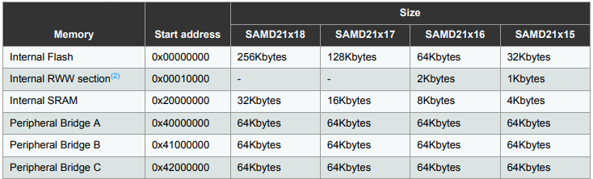
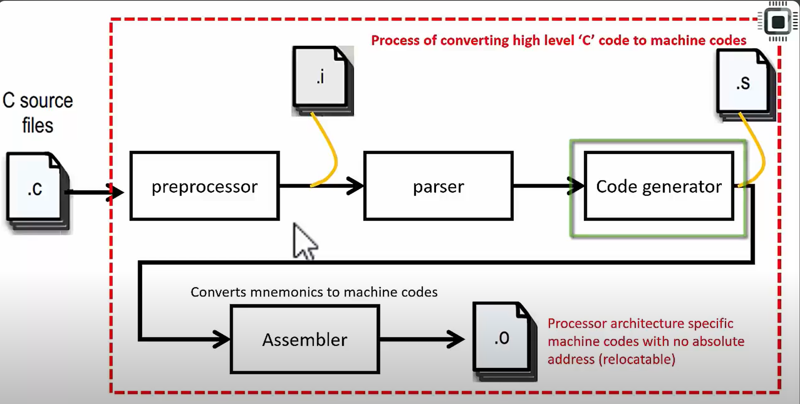
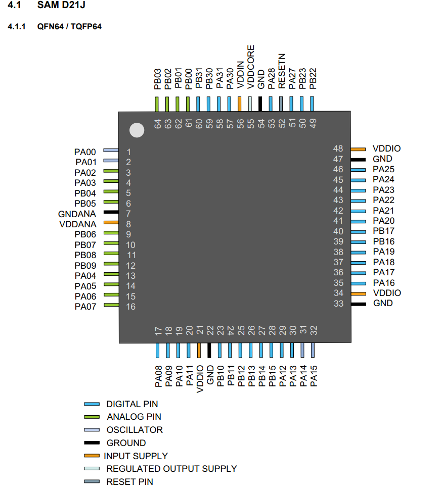
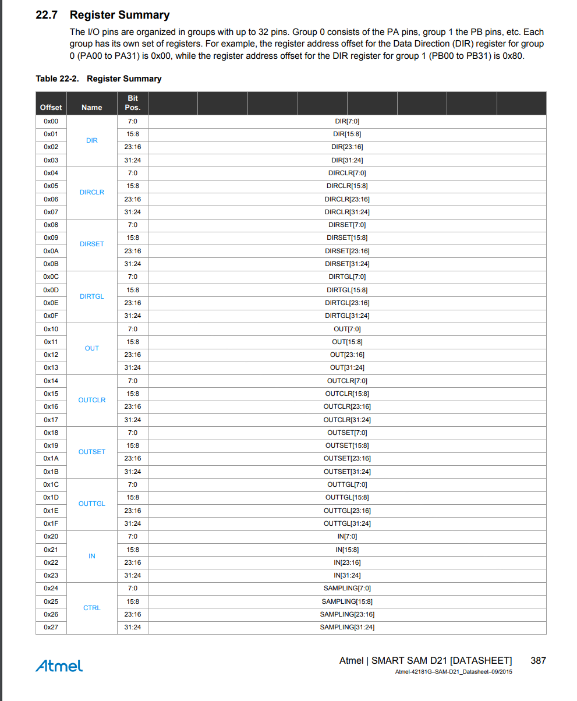

## Linux installation
- install make git
- install gcc-arm-none-eabi <!-- le gcc -->
- install stlink <!-- For flashing -->

## Informations
- Flash : 256Kb
- RAM : 32Kb
- [Tutorial Playlist](https://www.youtube.com/watch?v=qWqlkCLmZoE&list=PLERTijJOmYrDiiWd10iRHY0VRHdJwUH4g)




# Steps to understand
- ## Build process
    
    *  <b style="color: green;">arm-none-eabi-gcc</b>
        * flag ```-S``` : generate assembly code (-o file.s)
        * flag ```-c``` : compile only, no linking (-o file.o)
        * flag ```-mcpu=``` : specify the target processor
        * flag ```-mthumb``` : compile for thumb mode
        * flag ```-T``` : specify the linker script
        * flag ```-o``` : output file
        * flag ```-std=``` : specify the standard of C/C++
    * <b style="color: lightgreen;">arm-none-eabi-objdump</b>
        * flag ```-h``` : show the section and their addresses
        * flag ```-d``` : show the disassembly
- ## Relocatable obj file
    - sections such as ```.data```, ```.bss```, ```.main``` etc are all located to 0x00000000 = conflicts !
- ## MCU Startup File (from scratch)
    - Runs before ```main()``` function
    - create Vector table (Interruptions Handler)
        * MCU specific, look at the datasheet
        * Reserved space <b>MUST</b> be respected ! (function = 0)
        * use ```__attribute__ ((section (name_for_vector_section)))``` to relocate this section after in the <b>Linker Script </b>
    - initializes ```.data``` and ```.bss``` section
        * use ```Reset_Handler()``` because it's the first function called by Interruption when starting up the MCU
- ## Linker Script
    * this is the step when you relocate your sections.
    * compilation : ```$(CC) -nostdlib -T script.ld -o $(NAME).elf *.o ```
        ```C
        ENTRY (Reset_Handler) /* The first function when MCU reset. it's not the main ! */
        MEMORY { /* Define the memory */
            flash(rx): ORIGIN = 0x00000000, LENGTH = 256K
            sram(rwx): ORIGIN = 0x20000000, LENGTH = 32K
        }

        SECTIONS {  /* Define the sections */

            /* ".= flash ORIGIN" */
            .text : {
                *(.isr_vectors)
                *(.text)
                *(.rodata)
                _etext = .; /* Define the end of the text section */
            } > flash AT > flash

            .data : {
                _sdata = .;
                *(.data);
                _edata = .;
            } > sram AT > flash /* data from flash to sram */

            .bss : {
                _sbss = .;
                *(.bss)
                _ebss = .;
            } > sram
        }```
    * The linker does not show the link by default, you have to specify it with ```-Wl,-Map=$(NAME).map```
- ## MCU Startup file suite
    * ```Reset_Handler()``` is the first function called by the MCU when starting up
        so you must do the following (what you wrote in the linkerscript) :
        * copy the data from flash to sram
        * initialize the bss section
        * call the main function
    * for this, use the ```_etext```, ```_sdata```, ```_edata```, ```_sbss```, ```_ebss``` symbols with ```extern``` keyword
    (you can find them by using the ```arm-none-eabi-nm -h file.elf```)
    ```C
    extern unsigned int _etext; /* The end of the text section */
    extern unsigned int _sdata; /* The start of the data section */
    extern unsigned int _edata; /* The end of the data section */
    extern unsigned int _sbss; /* The start of the bss section */
    extern unsigned int _ebss; /* The end of the bss section */
    ```


## Configure GPIO (General Purpose Input Output)



